==========================================================================================
Ch.6 Event-Driven Time-Domain Behavioral Modeling of Phase-Locked Loops
==========================================================================================

Introduction
=================

* この節では、PLLのビヘイビアモデルについて説明する。まず最初に、PLLの回路設計の課題が、ビヘイビアモデルとどのように関係しているかを示す。もし、回路設計の経験があるのであれば、より精度のよいモデルを作るのに役立つだろう。その後、イベント・ドリブン型のPLLのモデルについて説明する。イベントドリブンのモデルにすることで、非常に高速に実行することができる。最後に、複雑なアルゴリズムを実装するために、プログラミング言語としてVerilog-AMSを使う方法について説明する。

.. This chapter discusses Phase-Locked Loop (PLL) behavioral modeling. First it shows how to link PLL circuit design issues with behavioral modeling techniques. Having circuit design experience helps to write more accurate models. Then, event-driven modeling of PLLs is discussed. Event-driven modeling can provide very fast models. Finally it shows how to use Verilog-AMS as a programming language to implement complex algorithms.

* PLLは、入力信号とVCOから出力される信号との位相差をなくすための回路である。これは、オペアンプを使用した負帰還の回路に似ている。オペアンプの負帰還回路では、2つの端子の電圧が同じになるように働く。

.. A PLL is a circuit that attempts to eliminate the phase difference between an input signal and a signal generated from a controlled oscillator. This is analogous to an op-amp placed in a negative feedback loop. The op-amp circuitis analyzed by assuming the two terminals are at equal voltages.

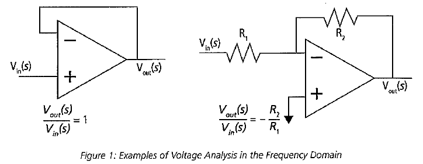

* 図1にオペアンプを使用したボルテージフォロア回路と反転増幅回路の例を示す。両方の回路共に、電圧を変数として、周波数ドメインで、特性を記述することができる。ボルテージフォロア回路の伝達関数は、回路を見るだけで容易に導くことができる。それに対して、非反転増幅器は、オペアンプの2つの入力が等しいと仮定して、キルヒホッフの電流則を使用しないと導くことができない。PLLの場合は、位相の情報を用いて、位相ドメインの式を解析的に導くことができる。図2にPLLのフィードバックパスとフォワードパスを持った位相ドメインのモデルを示す。設定によっては、PLLはユニティゲインバッファのように振る舞う。

.. Figure 1 shows two examples of a voltage follower and an inverting gain stage. Both can be analyzed using voltage variables in the frequency domain. The transfer function for the voltage follower is easily derived by inspection. The non-inverting amplifier follows by applying Kirchhoff's current law after assuming the voltages at the two op-amp inputs are equal. PLLs are often analyzed using phase as the analysis variable, leading to a phase-domain model. Figure 2 illustrates a basic phase-domain model of a PLL, with the output feedback and the forward gain path shown. In this configuration, the PLL is like a unity gain buffer

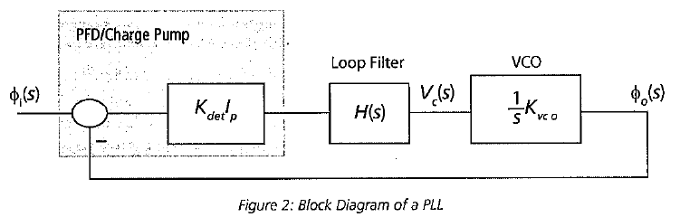

* 2つの信号の位相差が0であれば、周波数も同じになる。すなわち、位相がロックされると、通常、周波数もロックされる。この位相と周波数のロック現象により、基本のループ回路から、たくさんのPLLと回路を作ることができる。オペアンプのように、PLLもICの中でクリティカルなところに使用される。デジタルチップでは、クロック生成やクロックデスキュー用に使用される。また、通信用チップでは、PLLは周波数シンセサイザ[1]やクロックデータリカバリ回路[2]に用いられる。他には、AD変換器の中で使用されたり、信号の復調や、フィルタリング、モータの速度制御に使用される[3]。

.. If the phase difference at the inputs is zero, the frequencies of the two input signals will be the same. Phase lock usually implies frequency lock also. Both phase and frequency locking provide many uses for PLLs and circuits derived from the basic loop. Much like op-amps, PLL circuits can be used in many critical applications in integrated circuits. In digital chips, PLLs are used in clock generation and clock de-skewing applications. In communications chips, PLLs are used for precision frequency generation and synthesis[1] and in clock recovery applications[2]. Other uses include A/D conversion, demodulation of signals, filtering, and motor speed control[3]

* 図2に示すとおり、PLLの基本要素は、位相検出器(もしくは、位相・周波数検知器(PFD))、チャージポンプ回路、ループフィルタと電流/電圧制御発振器からなる。位相検出器は、2つの入力信号の位相差を検出し、位相差に応じた電流/電圧を生成する。チャージポンプ回路は、位相検出器の出力から、ループフィルタをドライブするための電流に変換する。ループフィルタは、誤差信号を平均化し、発振器の制御信号に変換する。原則として、PLLのは周期的な入力信号、もしくは、少なくともある期間だけは周期的な信号となっていることを仮定している。

.. The basic components of a PLL, as shown in Figure 2, are a phase detector or Phase-Frequency Detector (PFD), a charge-pump, a loop filter, and a current or voltage controlled oscillator. The phase detector is used to detect the difference in phase between the input signals, creating some type of error current or voltage. The charge-pump converts the phase detector output into a signal for driving the loop filter. The loop filter averages the error signal to provide a smooth control signal for the oscillator. A PLL typically assumes a periodic input, or at least an input that is periodic for a given amount of time.

* 2000年までは、PLLのモデリングは、ある種、芸術的なものであった。近年は、CPUの速度が上がったこともあり、PLL全体の回路でも回路シミュレータで数時間で解けるようになってきた。しかしながら、たとえジッタや位相雑音を考慮しなくともロック状態を過渡解析でシミュレーションするのは、未だに問題がある。そのため、正確なビヘイビアモデルによりシステムシミュレータで解析する必要がある。このシミュレーションには、時間領域・周波数領域で、ジッタや位相雑音などの不完全性を考慮する必要がある。正確なPLLのシミュレーションのために、イベント・ドリブン型のモデルを使用する場合のトレードオフについて、説明する。イベント・ドリブンのモデルは、周波数領域のモデルに置き換わるものである。回路設計の結果や過渡解析の結果から、非理想的なPLLのモデルを作成する方法についても説明する。非理想的な現象を再現するために、ビヘイビアモデルにノイズ源を配置しなければならない。イベント・ドリブンモデルを使用した場合の時間領域におけるジッタのモデリングの問題についても議論する。また、p.215の"PLL Model and Comparison"で、位相のモデルとの比較を行う。

.. Prior to 2000, the modeling of PLLs was something of an art form. In recent years, with advances in processor speeds, it has become possible to simulate a full PLL design, in a few hours, with circuit simulators. It still can be a problem to simulate the lock transient of a PLL design even without simulating effects such as jitter or phase noise. Accurate behavioral modeing approaches are needed to provide designers with models that can be inserted into system simulations. The effects of circuit imperfections, jitter, and phase noise need to be studied in these applications in both the time and frequency domains. An overview of the trade-offs in using event-driven models for obtaining accurate simulation of PLLs is provided. Event-driven models are an alternative to phase-domain models. An overview of modeling basic non-idealmes in PLL circuits from a circuit design and time-domain view is given. Emphasis is placed on finding the relevant circuit nori-idealitIes and adding them to behavioral models. The issues associated with time-domain jitter modeling using the event-driven model are discussed. A comparison to phase domain modals is given in the section "PLL MOdel and Comparison", on page 215.

Analysis of PLLs
====================

* PLLの計算方法について、簡単に説明する。まず、最初の節では、位相ドメインでの解析方法について述べる。2番目のセクションでは、改良した位相ドメインのモデルについて述べる。位相ドメインのモデルは、周波数解析にしか使用できないため、3つ目のセクションで時間領域で解く方法について述べる。

.. A brief synopsis of methods for analyzing PLLs is presented. The first section will illustrate the phase-domain analysis. The second section introduces an improvement to the phase-domain model. The phase-domain model is analyzed with respect to frequency, so the third section will describe PLL analysis with respect to time.

A Continuous-Time Phase-Domain Approximation for Frequency Domain Analysis
------------------------------------------------------------------------------------

* ここで説明する位相ドメインのアプローチは、Garner[4]が発表した手法に似ている。図2のPLLのモデルの個々のブロックについて、簡単に説明する。まず、解析のために、PLLがロックしている状態を仮定する。また、解析は周波数ドメインで行うため、ラプラス変数sを用いて、式を表現する。

.. The phase-domain approach presented here is similar to the one provided by Gardner[4]. The PLL shown in Figure 2 is analyzed. A brief discussion of each of the blocks in the figure is provided. A basic assumption for this analysis is that the PLL is locked. The analysis takes place in the frequency domain, so the Laplace variable s is used in the expressions.

* PFDブロックは、2つの入力信号の位相差を算出する。その後、(このモデルでは)チャージポンプ回路を用いて、位相差を電流に変換する。この変換ゲインを図2では、Kdetとしているが、ここでは簡単のため、1と仮定する。

.. The PFD computes the difference in phase between the two input signals. In this model, a chargepump is used to convert the phase difference to a current. There may be a gain associated with the Kdot as shown in Figure 2, but for this analysis, it is assumed to be 1.

* ループフィルタの伝達関数をH(s)とする。図3にチャージポンプPLLでよく使用されるループフィルタの回路とその伝達関数を示す。

.. The loop filter has a transfer function H(s). A common loop filler used in charge-pump PLLs is shown in Figure 3 along with an expression for H(s).

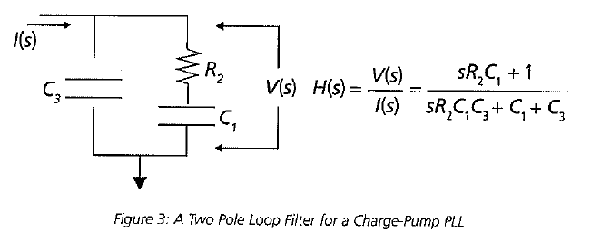

* 電圧制御発振器(VCO)は、入力電圧から対応する周波数に変換する。入力電圧と周波数の関係は、下記の式で表現される。

.. The Voltage-Controlled Oscillator (VCO) converts the input voltage to an output frequency, and the relationship between input voltage and output frequency can be represented as:

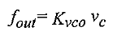

* VcをVCOの制御電圧とし、電圧と周波数の関係が線形であると仮定すると、電圧と位相の関係式は、非常にシンプルなものとなる。

.. The quantity Vc is the control voltage for the oscillator. The mapping from voltage to frequency is assumed to be linear, so a first-order model is simply:

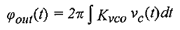

* 周波数ドメインでは、下記の式となる。

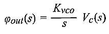

* 図2のVCOの箱の中には、ここで導いた伝達関数を書いている。

.. The transfer function for this equation was shown in Figure 2 within the VCO box.

* 位相ドメインでPLLの伝達関数を用いるために、まずはループをオープンにして、フォワード伝達関数を求める。ループを切るために、位相検出器の2番目の入力を0にする。一度に伝達関数を求めようとすると、巨大なものとなってしまうため、以下のように、いくつかの中間変数を定義する。

.. To derive a transfer function expressing the phase-domain model, the loop is first opened and analyzed to give the forward transfer function. To open the loop, assume that the second phase detector input is zero. The equations in the analysis become large, so several variables are defined in the following equations.

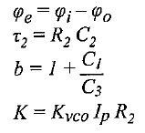

* これらの変数を使用することで、VCOの入力信号までの伝達関数は、以下のようになる。

.. Using these quantities, we can find the Laplace transform Vc(s) at the input of the VCO model.

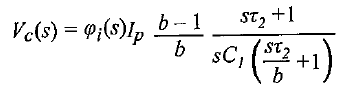

* さらに、VCOのゲインを加え、位相の出力と入力の関係に式を直すことで、以下の開ループ特性が求まる。

.. Adding the VCO gain and moving to the output node gives the open loop transfer function:

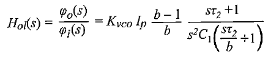

* 開ループ特性は、ループの安定性を解析するのに役に立つ。この特性を用いることで、閉ループ特性は下記のように求まる。

.. The open-loop transfer function is useful for analyzing the stabihty of the loop. Solving this equation for the closed-loop transfer function gives:

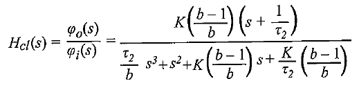

* このケースでは、閉ループ特性は3次の特性を持っている。そのため、このタイプのPLLを3次のPLLと呼ぶ。閉ループ特性は、伝達特性においてピークを持つかどうかや、帯域を解析するのに役に立つ。これらの解析については、p.196の"Performance Metrics for PLLs"で述べる。

.. The closed-loop transfer function in this case is third-order, so the PLL is third order. The closed loop transfer function is useful for analyzing if there is peaking in the transfer function and for estimating the bandwidth of the PLL. The importance of these issues will be discussed in the Section "Performance Metrics for PLLs' on page 196.

* 位相に着目して伝達関数を求めるやり方の利点は、シンプルである、というものである。位相特性の定式化や周波数ドメインでの解析によって、短時間でのPLLの解析が可能となる。しかしながら、この手法は本質的に線形であることを仮定しているため、小信号解析にして適用できない。

.. The key advantage of the phase transfer function approach is the simplicity. The phase formulation and the frequency domain analysis open the door to rapid design exploration. However, the method inherently uses a linearized approximation, so it really only applies to small-signal analysis.

Discrete-Time Phase-Domain Models for Frequency-Domain Analysis
------------------------------------------------------------------------------------

* 先ほどの節では、位相検出器は完全な引き算器としてモデル化した。実際の回路では、位相の比較は、離散時間(通常は、クロックエッジ)で行われる。PLLがロックに近い状態にあるとき、位相の更新は、入力信号の速度で起こる。より本質的には、位相検出器は、固定のサンプリングレートで位相の更新を行う。前節で説明した解析は、位相検出の動作レートが、ループの帯域の10倍以上速い時に成り立つものである。この前提が成り立たない場合、誤差が大きくなる。連続時間での解析手法を用いる場合、位相検出器の周波数領域での動作が現れないため、このような現象を防ぐことができない。ループの位相と帯域を表現する式だけが、ガードを作ることができる。

.. In the last section, the assumption was made that the phase detector could be modeled by a pure subtractor. In actual circuits, the phase comparison happens at discrete periods of time, usually between the clock edges, When the PLL is near lock, the phase updates come at the rate given by the input source. In essence, the phase detector operates at a fixed sampling rate to produce updates. The analysis presented in the last section is approximate and works wellif the operating rate of the phase detector is more than ten times the bandwidth of the loop. If this is not the case, significant errors can be introduced. There is no guard for this when using continuous-time analysis as the frequency of operation for the phase detector does not appear in the analysis. Only expressions for phase of the loop and bandwidth of the loop are created.

* 離散時間領域での解析を行うことで、精度を向上させることができる。ロックに近い状態にあり、位相検出器の入力信号の周波数がサンプリングレートだとする。この場合、論文[5],[6]に離散時間でのモデルの作り方が研究されている。サンプリングされたデータを使うため、ループの周波数ドメインの情報を求めるために、Z変換と離散フーリエ変換が使用される。

.. To increase accuracy, a discrete-time analysis can be performed. The loop is assumed to be near lock, and the sampling rate is the frequency of input signals at the phase detector. Techniques for creating a discrete-lime model have been studied in the literature, allowing approximations to be developed [5] 161, Since sampled data is assumed, the z-transforin aird discrete-time Fourier transform are used to obtain frequency-domain information about the loop.

Time-Domain Simulation
------------------------------------------------------------------------------------

* これまで述べた2つのモデルは、両方共、周波数ドメインで解析を行ったものであった。周波数ドメインの解析の利点は、高速にシミュレーションが行えることである。逆に欠点としては、大信号・非線形の挙動がモデリングされていないことと、PLLのロック現象の時間変動現象をシミュレーションできないことである。時間領域のシミュレーションでも、周波数領域の解析で得ることができる情報と同じものを得ることができる。しかしながら、シミュレーション時間が非常に大きくなる。これは、周波数ドメインのシミュレーションは、固定の周波数刻みでしか解析しないのに対して、過渡解析では、非常にたくさんの時間ポイントで計算しないといけないためである。特に、波形の形状に関心があるときには、細かいタイムステップで解析する必要がある。時間領域のシミュレーションは、SPICEの過渡解析と関係が深いため、好んで使用される。

.. The previous two methods focused on frequency-domain analysis. The advantage of frequency domain methods is fast simulation time. The disadvantages are the lack of modeling for large signal non-linear behavior and the inability to studying time-varying phenomenon such as PLL locking transients. Time-domain simulation can be used to obtain the same information that the previous two methods provide. However, it comes at a significant cost in simulation time Frequency-domain simulation involves evaluation at a fixed number of frequency points, Time domain simulation requires the circuit to be evaluated at many time points, especially if the shape of the waveformis of interest. Time-domain simulation is often favored becauseitis more closely related to the circuit simulator transient analysis of SPICE simulation.

* 典型的には、タイムドメインのモデルは、アナログソルバによって、時間ステップ毎の電圧値が計算される。Verilog-Aのモデルは、アナログソルバによって解析される。対照的に、デジタルモデルはイベントドリブンであり、信号値が変化した時のみ、解が計算される。スイッチトキャパシタの回路では、イベントドリブンのモデルを使用することで、10倍以上の高速化が得られる[7]。PLLは、出力のエッジがイベントにより発生し、位相変化が発生したときのみループが更新されるため、イベントドリブンとしてモデル化できる。この章では、Verilog-AMSを用いてイベントドリブンのPLLモデルを開発する方法を示す。

.. Typical time-domain models make use of an analog solver that solves for voltage values on a timestep driven basis. Verilog-A models make use of the analog solver, In contrast, digital models typically are event-driven, requiring solutions only when signals change, For switched-capacitor circuits, speed-ups in the range of 10X or more can be achieved when using an event-driven model t71, A PLL can be modeled as an event-driven system since the output edges are events and the loop is only updated when the phase detector fires. This chapter shows how to create an event-driven PLL model in Verilog-AMS.

Performance Metrics for PLLs
==================================

* PLLのシミュレーションには、非常に大きな時間がかかるために、ビヘイビアモデルが用いられる。また、ビヘイビアモデルを用いることで、what-if解析のために、様々なシナリオでの検証を行うことができる。設計の後期では、設計者は、製造の前に検証したい、という衝動に駆られるが、長時間のシミュレーションは受け入れることができない。このセクションでは、様々なPLLのパラメータについて、定義と議論を行い、シミュレーションやモデリングに関する問題に焦点をあてる。

.. The use of behavioral modeling for PLLs arises because of the excessive time needed for SPICE simulation. Behavioral models also enable the validation of different scenarios in simulations for what-if analyses. At the end of the design cycle, designers are driven to veriy their PLL designs prior to fabrication, and long simulation times become unacceptable. In this section, various PLL parameters are defined and discussed. The problems for simulation and modeling are highlighted.

Acquisition  Range and Output Frequency Range
------------------------------------------------------------------------------------

* PLLは、一般的に広帯域と狭帯域のカテゴリに分けることができる。この場合での帯域とは、出力する周波数のことを言う。狭帯域PLLは、出力する周波数の幅が狭い。VCOの設計により、周波数の範囲が決まる。そのため、VCOの設計により、PLLのタイプが決まる。PLLが検出し、追跡できる周波数の範囲によって、PLLが受け入れることができる入力周波数の範囲が決まり、正しく位相をロックできるかどうか決まる。これが、位相検出器とVCOの役割である。この章では、まず、位相をロックするまでの時間を短縮する方法について焦点をあてる。位相周波数検出器は、エラー信号を生成するために、位相と周波数の両方の情報を使用する。そのため、検出が可能なPFDの周波数レンジは、本質的にVCOの周波数レンジと同じになる。

.. PLLs are generally divided into the categories of wide-band and narrow-band. The band in this case refers to the frequency outputs that can be generated. A narrow-band PLL will be able to generate a signal over a small range of frequencies. The design of the VCO basically determines the frequency range, and thus the type of PLL. The acquisition or capture range of a PLL is the range of frequencies applied at the input that will allow the PLL to come to a correct pahse lock. This is a function of the phase detector and the VCO. The focus, in this chapter, is primarily on PLLs that use frequency aids in the phase detector to speed up phase locking. A PFD will use both phase and frequency information when calculating error signals. Because of this, the acquisition range when using a PFD will be essentially the same as the frequency range of the VCO.

PLL Stability
------------------------------------------------------------------------------------

* 位相ドメインの解析で得られたオープンループ伝達関数は、PLLの安定性を解析するために使用される。安定性の評価に使用される一つの指標は、位相余裕である。PLLのオープンループの周波数応答をH(jw)とし、ph(H(jw))を位相の特性とすると、位相余裕(PM)は、下記の式で表現できる。

  PM = 180 + ph(H(jw))@(H(jw)=1)

.. The open-loop transfer function from the phase-domain analysis can be used to measure and study PLL stability. One metric used for stability is phase margin. If H(jw) is the open-loop frequency response of the PLL, the ph(H(jw)) is the phase response of H(jw) expressed in degrees, then phase margin PM in degrees is defined as in the equation below.

* 位相余裕は、オープンループゲインが1になる時の位相に180を加えた値で定義される。原則的には、設計者は60度以上の位相余裕を取って設計する。他のフィードバックシステムのように、他の計測方法(例えば、ゲイン余裕)でも安定性を計測することが可能である。オペアンプを用いたフィードバック系では、どちらの指標も使用される。

.. Phase margin is defined as 180 degrees plus the value for the phase for the open-transfer function in degrees when the magnitude is unity. Typically, designers will keep the phase margin for a system above 60 degrees. As with other feedback systems, other measures of stability are possible, such as gain margin. Both measures are also used in feedback systems crated with op-amps[8].

* PLLのタイムドメインでの安定性は、閉ループPLLの位相のステップ応答から推測することができる。ダンピングが発生している2次の閉ループ系では、小さなオーバーシュートが存在している。このように、システムの不安定性は、位相ドメインでの過度なリンギングとオーバーシュートからもたらされる。

.. PLL stability can be inferred in the time domain from the phase step response of a closed-loop PLL. For a second-order loop with critical damping, a small overshoot will exist. Instability will be indicated by excessive riging and overshoot when the phase step is applied.

* PLLの不安定性は、位相の振動となって現れる。つまり、瞬時の周波数の振動となって現れる。もし、固定の入力周波数を持った信号を与えることができたとしても、出力周波数は、継続的に変動してしまう。

.. PLL instability can exhibit itself through oscillation of the phase. This appears to be an oscillation of the instantaneous frequency. If fixed input frequency is applied, the output frequency will vary continously.

Loop Bandwidth, Peaking, and Tracking Behavior
------------------------------------------------------------------------------------

* PLLの入力信号は、通常、周期的な信号である。もし、PLLの入力信号に周波数の変動があった場合、位相の差が0となるように、PLLは入力信号に追従する。この特性のおかげで、PLLはFM信号の復調器として使用することができる。直前の節で見たように、PLLのバンド幅は、周波数ドメインの解析から求まる。

.. The input to the PLL is typically a periodic signal. If the input to the PLL is a signal that varies in freqency, the PLL will attempt to track the signal at zero phase. It is this tracking property that makes PLLs useful for demodulating FM signals. The bandwidth of the PLL can be determined, as shown in the last section, using a frequency-domain analysis.

* 入力信号の位相から見た場合のPLLの伝達特性は、ローパスフィルタとなる。そのため、ピーキング特性が含まれている場合がある。図4に3次のPLLの周波数特性を示す。この図から分かる通り、20kHz付近に3dB程度のピーキングが存在している。PLLをカスケードにした場合、このような過度なピーキングが(減衰型のループだとしても)問題を引き起こす場合がある。このピーク領域にノイズ信号が入ってくると、そのノイズは増幅されてしまう。この例のように、ピーキングの効果を確認するために、位相ドメインと時間ドメインのシミュレーションが使用される。

.. While the input phase transfer function for the PLL is low pass in nature, there is no guarantee that it does not contain peaking. Figure 4 illustrates the response for a thied-order PLL. The response peaks in the 20kHz region at less than 3dB. Excessive peaking (an under-damped loop) can cause problems when PLLs are cascaded. The area of peaking represents gain, so any noise in this region is amplified. In this case, both phase-domain and time-domain simulation can be used to study the effects of peaking.

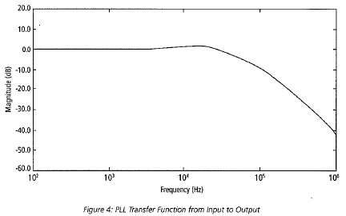

* ループの追従性は、バンド幅に関連している。ループの帯域幅は有限であるため、急速で瞬時の周波数の変化には、追従することができない。急な入力信号の変化が起こると、瞬時にロックが外れ、補足のプロセスが始まる。この問題も位相と時間ドメインのシミュレーションを行うことで、解析することができる。

.. The tracking behavior of the loop is related to the bandwidth. Since the bandwidth of the loop is finite, the loop cannot track signals that have rapid or sharp frequency transitions. For sudden input frequency changes, the loop can mementarily lose lock then begin an acquisition process. These problems can be studied in both that phase and time domains through simulation.

Lock Time
------------------------------------------------------------------------------------

* PLLのロック時間は、入力周波数に追従し、特定の位相誤差範囲内まで落ち着くまでの時間である。PLLのロック過程を図5に示す。このように、ロック過程はスムーズにいかない。このギザギザは、ループフィルタに注入されるチャージポンプの電流によるものである。

.. The lock time of a PLL is the time needed for a PLL to acquire the input frequency and then settle to less than a specified phase error. The tail end of a PLL lock transient is shown in Figure5. Note that is is not a smooth transient. The jaggedness is caused by the updates of the charge-pump applied to the loop filter.

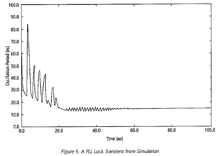

* この特性は、周波数シンセサイザやクロック生成回路には、非常に重要なものである。高周波では、PLLやクロック網で多くの電力を消費してしまう。電力マネージメントの方法によっては、電力の消費をセーブするために、PLLをシャットダウンする方法がメジャーになりつつある。このような用途では、PLLが使用される前に安定化する必要があるため、ロック時間を最小化する必要がある。固定バンド幅のPLLのロック時間は、ループの帯域に関係している。クロック生成用途では、ループの安定性のために、低いバンド幅が要求される。しかしながら、低帯域のPLLの場合、追従のための動きが遅くなり、ロック時間が長くなってしまう。そのため、可変のバンド幅を持ったPLLが提案されている。この問題は、通常、時間ドメインのシミュレーションで解析される。そのため、PLLのシミュレーションを高速化するために、ビヘイビアモデルによる解析が重要となる。

.. This metric is important for frequency synthesizers and clock generation applications. At high frequencies, PLLs and clock networks can consume quite a bit of power. In different power management schemes, it has become popular to shut down the PLL to save power. The lock time indicates the minimum time needed for the clock to become stable before it can be used. The lock time in fixed-bandwidth PLLs is related to the bandwidth of the loop. For clock generation, low PLL bandwidths are often needed to keep the loop stable. However the low PLL bandwidth means a slow tracking behavior and a long lock time. Variable bandwidth PLLs have been proposed to address this problem. These issues are typically studied using time-domain simulation. Behavioral modeling is important to allow rapid simulaiton of many PLL cycles.

Static Phase Error
------------------------------------------------------------------------------------

* PLLは、ゼロ遅延のクロックバッファのようなアプリケーションにも用いられる。PLLドライバの位相誤差はゼロなので、入力と出力信号の遅延もほぼゼロとなる。この特性は、通常、回路シミュレーションを用いて、回路レベルで解析される。

.. PLLs can be used in clocking applications as zero-delay clock buffers. The delay between the input and output appears to be nearly zero because the PLL drivers the phase error to zero. This metric is typically studied at the circuit level using circuit simulation.

Jitter
===========

* サイクルジッタは、周期ジッタと異なり、隣接間の周期の差を計測したものである。図6の例だと、最大サイクルジッタは|1.2-0.8|=0.4となり、最小サイクルジッタは|1.0-1.2|=0.2となる。このジッタは、ロジック回路のクリティカルパスの最小値に影響を与えることになるため、プロセッサシステムにおいて重要な指標となる[9]。いくつかのクロックパルスを与えた場合に、通常、最長の周期と最小の周期が近くなることはないため、サイクルジッタは、周期ジッタよりも楽観的なものとなる。

.. Cycle-to-cycle jitter is the difference in the period measurement between adjacent cycles. For the example of Figure 6, the maximum cycle-to-cycle jitteris |1.2-0.8| = 0.4 and the minimum is |1.0-1.2| = 0.2. This value is critical in processor systems as it helps determine the minimum expected period for critical paths in the logic[9]. The cycle-to-cycle jitter value is less pessimistic than period jitter. It is not typically the case that the longest and shortest periods are near each other, which is the number that period jitter gives.

* ジッタは時間的に隣接した周期との差で特徴づけられるが、ジッタのスペクトラムも重要になることがある。このジッタスペクトラムは、周期やサイクルの変動の分布をプロットすることで得ることができる。複数のクロック系統が存在する場合、その分布は2重にも3重にもなる。このことはまた、支配的なノイズ源をクリアにするヒントを与えることがある。ノイズ源は、周波数依存性を持つことがある。この場合、ジッタよりも位相雑音で検証した方が良い場合がある。

.. While jitter is typically characterized by single numbers, the spread of jitter is often important. It can be seen by plotting a distribution of the period or cycle variation. In systems with multiple clocks, the distribution can be bimodal or trimodal. This in turn gives clues about the dominant noise sources. There may be a frequency dependency of the noise, which is best expressed by examining the phase noise rather than jitter.

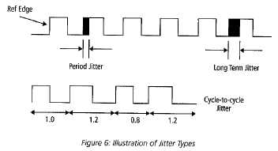

The cause of cycle-to-cycle jitter in real systems tends to be dominated by localized di/dt noise from circuits that cause modulation of the clock distribution tree. Behavioral modeling of this type of noise might be achieved outside of the PLL using a period modulation approach.

Summary
------------

In this section, various PLL metrics were discussed and defined, These are quantities that designers are interested in and will write models in order to quantify a given parameter for the design. Noise or jitter performance of a PLL is often the most important performance parameter. In the next section, Verilog-AMS models are presented for modeling PLLs in Ihe time domain.
